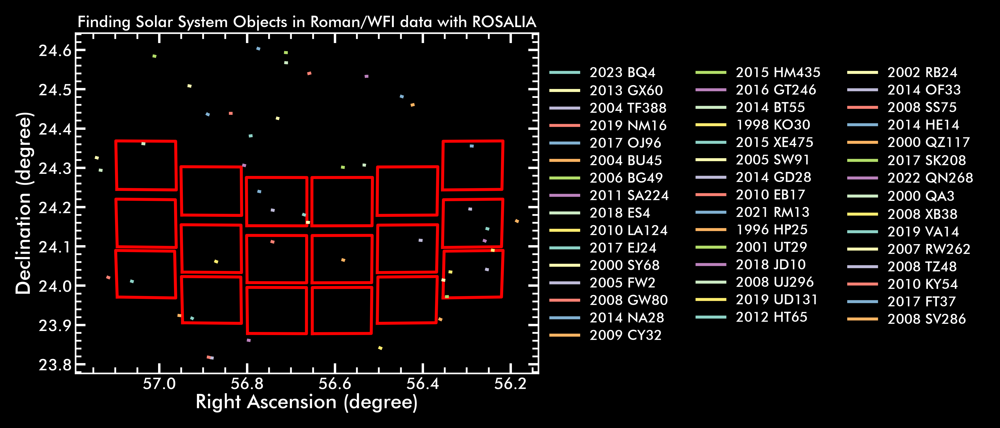

Solar System Objects
=========

Are there any asteroids in my Roman images?
-----------------------------

*ROSALIA* allows the user to estimate much more than stray-light on Roman WFI exposures. In this section, we will demonstrate how to use of ROSALIA to find out which Solar System Objects are in your Roman datasets. Following the previous tutorial, we will use datasets stored in the Roman Nexus cloud. We will access a pre-generated Roman mock observation, generate a ROSALIA exposure object, and then use the `rosalia.core.exposure.get_nearby_ssos()` method to automatically query and propagate the orbits of known Solar System Objects stored in the Minor Planet Center database. 

To estimate the locations of the SSOs, ROSALIA uses another package built by our team named `EPHESSOS <https://pypi.org/project/ephessos/>`_. *EPHESSOS* automatically queries orbital parameters from the `Minor Planet Center database <https://www.minorplanetcenter.net/iau/mpc.html>_` , and propagates the orbits through `JPL/Horizons <https://ssd.jpl.nasa.gov/horizons/app.html#/>`_, returning the expected trajectory along the duration of the Roman / WFI exposure. All this happens in the background after using the `rosalia_exposure.get_nearby_ssos()` method. 

Here we show one quick example:

.. code-block:: python

    import rosalia as rs
    import matplotlib.pyplot as plt
    from astropy.time import Time

    ra = 56.6583333  # Right ascension, in degrees. 
    dec = +24.1780556 # Declination, in degrees.
    PA = 0 # Position angle, in degrees.
    date = Time("2026-12-01T00:00:00") # Date of the observation, in Astropy Time YYYY-MM-DDTHH:MM:SS format.
    bandpass = "F129"
    exptime = 600 # Exposure time, in seconds.

    observer={"TELESCOP": "Roman/WFI", 
            "pointing": [ra, dec], 
            "FILTER":bandpass, 
            "PA_Y": PA, 
            "EXPSTART": date.mjd, 
            "EXPTIME": exptime}

    prefix = "Pleiades"
    custom_roman_exposure = rs.core.exposure(observer=observer, prefix=prefix) 

    # Here we execute the Solar System Object query method to estimate the trajectories of known SSOs. 
    cone_search, ssos_db = custom_roman_exposure.get_nearby_ssos(verbose=False, time_step="1m")

    plt.style.use('dark_background') # For some dramatic effect. 
    ax = custom_roman_exposure.plot_footprint(figsize=(14,6))
    for i in range(len(ssos_db)):
        ax.plot(ssos_db[i]["RA_deg_ICRF"], ssos_db[i]["DEC_deg_ICRF"], label=ssos_db[i]["Designation"].iloc[0])
        ax.legend(frameon=False, loc='center left', bbox_to_anchor=(1, 0.5), ncol=3)
    ax.xaxis.set_inverted(True) 
    ax.set_title("Finding Solar System Objects in Roman/WFI data with ROSALIA", fontdict={"fontsize": 16})
    plt.tight_layout()
    plt.savefig("test_SSOs_in_Roman_WFI_exposure.png", dpi=300)
    plt.show()
            

The `ssos_db` is a `pandas.DataFrame` table that contains the predicted location of all known Solar System Objects in the Minor Planet Center database nearby the focal plane array of the designated Roman WFI exposure. 

