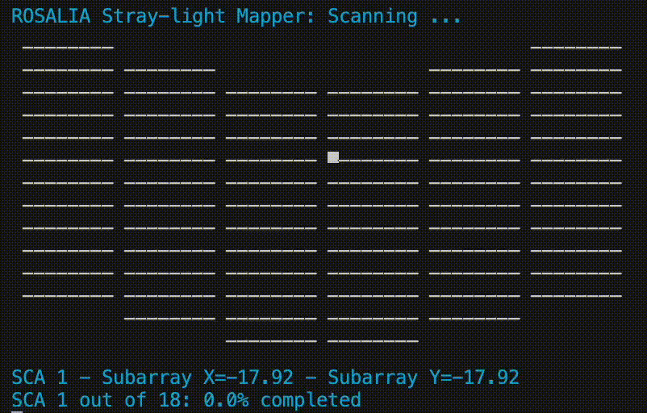

Tutorials
=========

This section contains some code examples and Jupyter notebook tutorials to help you get started with ROSALIA and its functionalities.

Baby steps: Transforming ASDF to FITS
-----------------------------
`ASDF <https://asdf.readthedocs.io/en/latest/>`_ is the successor of `FITS <https://www.stsci.edu/hst/wfpc2/Wfpc2_dhb/intro_ch23.html>`_ format and has been adopted since JWST. While GUI visualizers like SAO DS9 are not yet compatible with ASDF (`see JWST Users Committee note <https://www.stsci.edu/files/live/sites/www/files/home/jwst/science-planning/user-committees/jwst-users-committee/_documents/jstuc-0919-data-analysis-tool-ferguson.pdf>`_), ROSALIA provides an easy way to extract useful information from ASDF files through ``exposure-inspector``:

.. code-block:: python

    import rosalia as rs 
    exposure_identity = rs.utils.exposure_inspector(input_name="your_exposure.asdf")

``rs.utils.exposure_inspector`` returns a series of fields containing basic information from the ASDF tree, including the name of the telescope, instrument, detector, pointing information (RA/Dec), WCS of the header(s). For Roman and Hubble Space Telescope exposures, ROSALIA will automatically find the filter transmission curve in `SVO server <https://svo2.cab.inta-csic.es/svo/theory/fps/>` and include it in the output. 

If the input FITS files correspond to multiple SCI exposures (e.g., one per SCA), the output will be a list of arrays, one per exposure. For Roman/WFI, one ASDF file per SCA (detector) will be generated. To combine the information from multiple ASDF files, we can use a pattern. For example, if we have 18 ASDF files named ``your_exposure_SCA01.asdf``, ``your_exposure_SCA02.asdf``, ..., ``your_exposure_SCA18.asdf``, we can use the following command to extract the information from all 18 files at once:

.. code-block:: python

    import rosalia as rs 
    exposure_identity = rs.utils.exposure_inspector(input_name="your_exposure_SCA*.asdf")

The output will be a single FITS file containing the combined information from all 18 ASDF files, which can be easily visualized in SAODS9 or any other FITS viewer. The name of the output FITS file will be the same as the input pattern, but with the ``*`` replaced by ``_`` and the extension changed to ``.fits``. For example, the output file for the previous command will be named ``your_exposure_SCA_.fits``.

exposure-inspector can be used in the terminal as well, by providing the name of the ASDF file as an argument. For example:

.. code-block:: sh

   exposure-inspector RST_WFI_ROSALIA_test_Orion_Belt_SCAWFI01.asdf

Producing the same resutls as the previous Python command, but in the terminal.

Generating some mock Roman / WFI observations
---------------------------------------------

``ROSALIA`` works over level 2 images. We can use ``romanisim`` to generate mock Roman/WFI exposures. This is particularly useful for testing ``ROSALIA``'s functionalities on Roman data, and for visualizing the impact of stray light on Roman/WFI observations. Note that this is not needed to run ``ROSALIA``, as the main modules will accept coordinates and WCS information as input, and will generate dummy images. However, ``romanisim`` includes multiple processing effects on  to generate a realistic Roman/WFI exposure, and then use ``ROSALIA`` to analyze the stray light in that exposure. We encourage users to visit the official webpage of ``romanisim`` for more information on the package and its functionalities: https://romanisim.readthedocs.io/en/latest/, but we include a simple example here to get you started.

1. Install ``romanisim`` and generate a Roman/WFI example image. For this experiment—*and to maximize the visualization of stray-light*—we will simulate an exposure near Orion's Belt.

   .. code-block:: sh

      pip install romanisim
      romanisim-make-image --radec 83.3419927 -1.9665163 RST_WFI_ROSALIA_test_Orion_Belt_SCA{}.asdf --roll -45 --sca -1 --bandpass F158 --level 2 --usecrds

   .. note::

      ``romanisim`` is a package in active development. Please visit the official webpage for more information on usage: https://romanisim.readthedocs.io/en/latest/

   Notice the {} in the filename and the -1 in the --sca argument. That will instruct ``romanisim`` to generate files for the 18 Roman / WFI SCAs. The result from the previous command will be a series of files (18 in total, one ASDF file per Roman / WFI SCA) in the local directory.

   .. code-block:: console

      -rw-r--r--   1 user  staff   391M Nov 26 16:02 RST_WFI_ROSALIA_test_Orion_Belt_SCAWFI01.asdf
      -rw-r--r--   1 user  staff   391M Nov 26 15:39 RST_WFI_ROSALIA_test_Orion_Belt_SCAWFI02.asdf
      -rw-r--r--   1 user  staff   391M Nov 26 15:42 RST_WFI_ROSALIA_test_Orion_Belt_SCAWFI03.asdf
      -rw-r--r--   1 user  staff   391M Nov 26 15:46 RST_WFI_ROSALIA_test_Orion_Belt_SCAWFI04.asdf
      -rw-r--r--   1 user  staff   391M Nov 26 15:49 RST_WFI_ROSALIA_test_Orion_Belt_SCAWFI05.asdf
      -rw-r--r--   1 user  staff   391M Nov 26 15:53 RST_WFI_ROSALIA_test_Orion_Belt_SCAWFI06.asdf
      -rw-r--r--   1 user  staff   391M Nov 26 15:56 RST_WFI_ROSALIA_test_Orion_Belt_SCAWFI07.asdf
      -rw-r--r--   1 user  staff   391M Nov 26 15:59 RST_WFI_ROSALIA_test_Orion_Belt_SCAWFI08.asdf
      -rw-r--r--   1 user  staff   391M Nov 26 16:03 RST_WFI_ROSALIA_test_Orion_Belt_SCAWFI09.asdf
      -rw-r--r--   1 user  staff   391M Nov 26 16:06 RST_WFI_ROSALIA_test_Orion_Belt_SCAWFI10.asdf
      -rw-r--r--   1 user  staff   391M Nov 26 16:10 RST_WFI_ROSALIA_test_Orion_Belt_SCAWFI11.asdf
      -rw-r--r--   1 user  staff   391M Nov 26 16:13 RST_WFI_ROSALIA_test_Orion_Belt_SCAWFI12.asdf
      -rw-r--r--   1 user  staff   391M Nov 26 16:22 RST_WFI_ROSALIA_test_Orion_Belt_SCAWFI13.asdf
      -rw-r--r--   1 user  staff   391M Nov 27 07:14 RST_WFI_ROSALIA_test_Orion_Belt_SCAWFI14.asdf
      -rw-r--r--   1 user  staff   391M Nov 27 08:53 RST_WFI_ROSALIA_test_Orion_Belt_SCAWFI15.asdf
      -rw-r--r--   1 user  staff   391M Nov 27 08:56 RST_WFI_ROSALIA_test_Orion_Belt_SCAWFI16.asdf
      -rw-r--r--   1 user  staff   391M Nov 27 09:00 RST_WFI_ROSALIA_test_Orion_Belt_SCAWFI17.asdf
      -rw-r--r--   1 user  staff   391M Nov 27 09:04 RST_WFI_ROSALIA_test_Orion_Belt_SCAWFI18.asdf

   These 18 files represent a single Roman/WFI level 2 (calibrated, non-combined) exposure.

Stray Light Analysis Example
-----------------------------

Learn how to use ROSALIA to analyze stray light in a simple optical system.

* :download:`R1_Rosalia_stray_example.ipynb <../../notebooks/R1_Rosalia_stray_example.ipynb>`

This tutorial demonstrates:

- How to set up observational parameters (RA, Dec, Position Angle, date, bandpass, exposure time)
- How to use the `rosalia_stray` function to calculate stray light
- How to interpret and analyze the results

To run this notebook locally, make sure you have Jupyter installed and then:

.. code-block:: bash

    jupyter notebook notebooks/R1_Rosalia_stray_example.ipynb

Estimating the surface brigthness limit of Roman WFI observations
-----------------------------

In this tutorial you can find an example of use of a very approximate function to estimate the surface brightness limit of Roman/WFI observations as a function of the exposure time and the level of stray light in the field. This is not meant to be a rigorous calculation, but rather an example of how to use ROSALIA to quickly estimate the impact of stray light on the surface brightness limit of Roman/WFI observations. 

This is a very crude solution that does not take into account systematic effects like flat field, CTE, bias, or gradients. The only limiting factor is photon noise from Zodiacal light. However, Zodiacal light is 95% of the limit, so it will work sufficiently well for most purposes.

For a more realistic simulation, we recommend to simulate the individual exposures with Romanisim: https://romanisim.readthedocs.io/en/latest/, and then combine the individual exposures. The resulting noise then will include the systematic effects mentioned above. 

* :download:`R0_Surface_brightness_limit.ipynb <../../notebooks/R0_Surface_brightness_limit.ipynb>`
