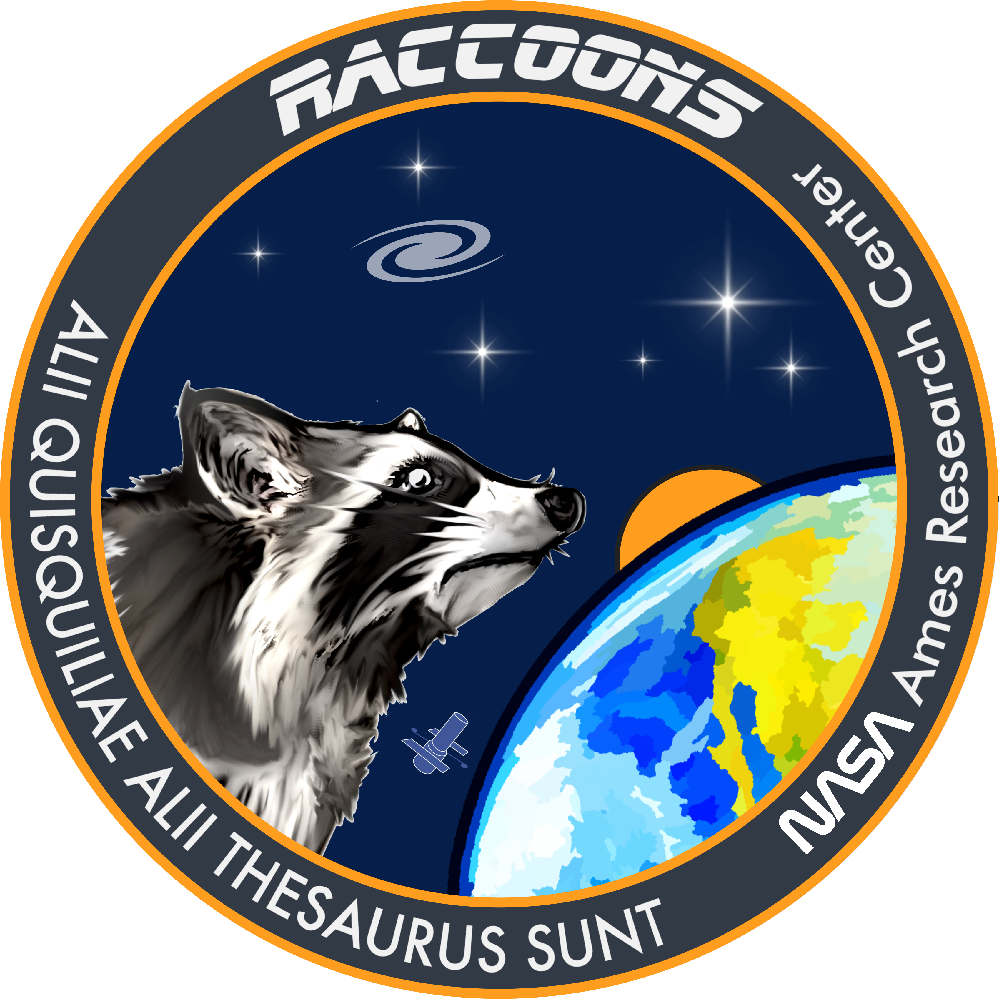

Who is ROSALIA?
===============

**ROSALIA** is being built and supported by the RACCOONS team at the Space Science and Astrobiology division of the NASA Ames Research Center. *ROSALIA* is funded through a NASA Grant (D.14 Roman 2022), *ROSES/Nancy Grace Roman Space Telescope Research and Support Participation Opportunities.*.
